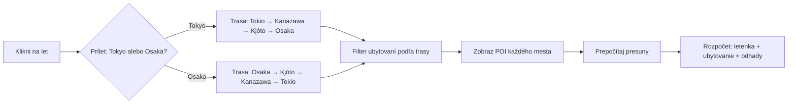
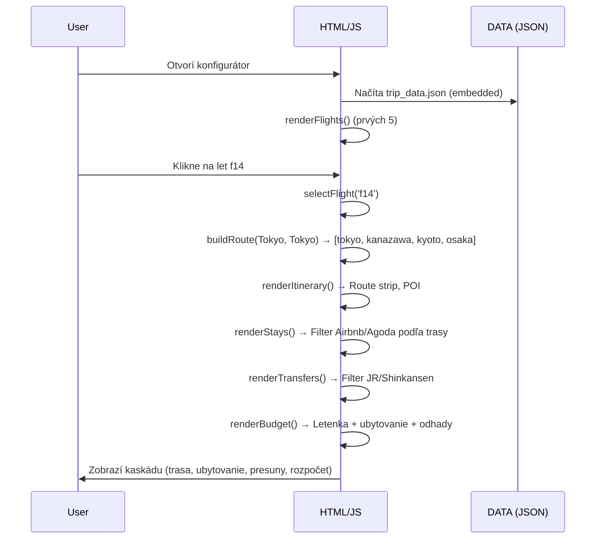
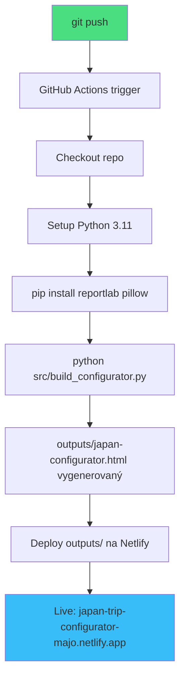

# 🇯🇵 Japan Trip Planner — Interactive Configurator

**Live konfigurátor cesty pre 5 osôb** | Tokio, Kanazawa, Kjóto, Nara, Osaka, Himeji  
🔗 **[japan-trip-configurator-majo.netlify.app](https://japan-trip-configurator-majo.netlify.app/japan-configurator.html)**

<div align="center">


</div>

---

## 🎯 Čo to robí

**Interaktívny HTML konfigurátor**, ktorý ti umožňuje:

1. **Vybrať letenku** z 15 overených a neoverených ponúk (VIE/BUD → Tokio/Osaka)
2. **Vidieť automaticky prepočítanú trasu** podľa príletového a odletového mesta
3. **Zistiť konkrétne ubytovanie** (Airbnb/Agoda) pre vybraných 5 ľudí a 2 izby
4. **Prezrieť si POI, aktivity, presuny** medzi mestami
5. **Vidieť orientačný rozpočet** na osobu (letenka + ubytovanie overené, doprava/jedlo odhad)

### 🔄 Ako funguje kaskáda



### 🎨 Dark minimalistická téma

- **Responsívny dizajn** — škáluje sa od mobilu po desktop pomocou `clamp()`
- **Tmavé farby** (`--bg-0:#05070c`, `--accent:#38bdf8`)
- **Žiadne JS frameworky** — čistý vanilla JavaScript, ~46 KB HTML

---

## 🚀 Automatické nasadenie

Každý `git push` do `main` automaticky:

1. ✅ **Zbuilduje** konfigurátor (`python src/build_configurator.py`)
2. ✅ **Nasadí** na Netlify cez GitHub Actions
3. ✅ **Live za ~2-3 minúty** na https://japan-trip-configurator-majo.netlify.app

```bash
# Zmeň dáta
nano data/trip_data.json

# Commitni a pushni
git add data/trip_data.json
git commit -m "Update Korean Air verified fare"
git push

# GitHub Actions to spraví automaticky:
# → Build → Deploy → Live
```

**Workflow:** [`.github/workflows/deploy.yml`](.github/workflows/deploy.yml)  
**Status:** [github.com/originalmagneto/japan-trip-planner/actions](https://github.com/originalmagneto/japan-trip-planner/actions)

---

## 📁 Štruktúra projektu

```
japan-trip-planner/
├── data/
│   ├── trip_data.json                 # Letecké možnosti, lokácie, POI, aktivity
│   ├── accommodation_options.json     # Overené Airbnb/Agoda ponuky
│   └── schema.md                      # Pravidlá pre zadávanie dát
├── src/
│   ├── build_configurator.py          # Python builder (načíta dáta, naplní template)
│   ├── configurator_template.html     # HTML + CSS + vanilla JS šablóna
│   ├── build_site.py                  # Staršia prezentačná verzia
│   ├── build_html.py                  # Jednoduchá tabuľková verzia
│   └── build_pdf.py                   # PDF export cez ReportLab
├── outputs/                           # Generované súbory (ignorované v git)
│   ├── japan-configurator.html        # ← Hlavný konfigurátor
│   ├── japan-configurator.md
│   └── japan-configurator.pdf
├── tests/
│   ├── test_configurator.py           # Unit testy pre konfigurátor
│   └── test_trip_data.py              # Validácia dátového modelu
├── docs/                              # Markdown dokumenty (itinerár, rozpočet...)
├── .github/workflows/
│   ├── deploy.yml                     # Auto-deploy na Netlify
│   └── test.yml                       # Unit tests pri PR
└── README.md                          # Tento súbor
```

---

## 🛠️ Lokálny development

### Požiadavky

- Python 3.11+
- `pip install reportlab pillow` (pre PDF export)

### Build

```bash
# Clone repo
git clone https://github.com/originalmagneto/japan-trip-planner.git
cd japan-trip-planner

# Install dependencies
pip install reportlab pillow

# Build konfigurátor
python src/build_configurator.py

# Otvor v prehliadači
open outputs/japan-configurator.html
```

### Testy

```bash
python -m unittest discover -s tests -v
```

---

## 📊 Dátový model

### `data/trip_data.json`

```json
{
  "trip": {
    "travellers": 5,
    "rooms": 2,
    "carry_on_only": true,
    "outbound_window": ["2026-09-24", "2026-09-26"],
    "return_window": ["2026-10-10", "2026-10-14"]
  },
  "flight_options": [
    {
      "id": "f1",
      "label": "Viedeň → Tokio, najjednoduchší základ",
      "origin": "VIE",
      "arrival": "TYO",
      "departure_date": "2026-09-24",
      "return_date": "2026-10-12",
      "price_total_eur": 6538,
      "verified": false,
      "arrival_city": "Tokyo",
      "departure_city": "Tokyo",
      "route_effect": "prílet aj odlet Tokio; najľahšie plánovanie"
    }
  ],
  "locations": [
    {
      "id": "tokyo",
      "name": "Tokio",
      "nights": 4,
      "pois": [...],
      "activities": [...]
    }
  ],
  "transfers": [...],
  "accommodations": [...]
}
```

### `data/accommodation_options.json`

Overené ponuky z Airbnb/Agoda s:
- `verified: true/false` (checkout overené)
- `two_rooms_exact: true/false` (presne 2 izby vs. apartmán)
- `total_eur` — celková cena pre všetkých 5 hostí
- `cancellation`, `taxes`, `area_station`

**Pravidlá:** [`data/schema.md`](data/schema.md)

---

## 🎨 Dizajn princípy

### Responzívna typografia

Všetky veľkosti používajú `clamp()` — automaticky škáluje medzi min/preferred/max:

```css
h1 { font-size: clamp(2.2rem, 5vw, 4.5rem); }
body { font: clamp(15px, 1.8vw, 17px)/1.6 ui-sans-serif; }
.wrap { max-width: clamp(900px, 88vw, 1400px); }
```

### Dark palette

```css
:root {
  --bg-0: #05070c;   /* Najhlbšie pozadie */
  --bg-1: #0a0d12;   /* Segments, panels */
  --bg-2: #0f131c;   /* Cards */
  --bg-3: #161d2b;   /* Route stops, hover */
  --ink: #e8eef3;    /* Text */
  --muted: #8a9aa8;  /* Secondary text */
  --accent: #38bdf8; /* CTA, prices */
  --warm: #e9a568;   /* Badges, arrows */
}
```

### Interaktivita

- **Kliknuteľné flight cards** — `onclick="selectFlight('f1')"`
- **State management** — `state.selectedFlightId`, `state.routeLocationIds`
- **Render funkcie** — `renderFlights()`, `renderItinerary()`, `renderStays()`, `renderTransfers()`, `renderBudget()`

---

## 📐 Architektúra



---

## 🌐 Deployment flow



---

## 🧪 Test coverage

### `tests/test_configurator.py`

- ✅ HTML embeds complete `DATA` payload
- ✅ All render functions present
- ✅ Sort controls and event listeners
- ✅ Markdown uses same data model

### `tests/test_trip_data.py`

- ✅ 5 travellers, 2 rooms declared
- ✅ All locations have POIs, activities, weather, maps
- ✅ Verified accommodation for Tokyo and Kyoto
- ✅ Transfer purchase links present

**Run:** `python -m unittest discover -s tests -v`

---

## 🔐 Secrets management

GitHub Actions používa tieto secrets (nastavené v repo settings):

- `NETLIFY_AUTH_TOKEN` — Netlify personal token
- `NETLIFY_SITE_ID` — `59ab669d-e6c2-431a-bab1-fa22f8028ed1`

**Nikdy sa nezobrazia** v logoch ani v public repo.

---

## 📝 Ako pridať novú letenku

1. Otvor [`data/trip_data.json`](data/trip_data.json)
2. Pridaj nový objekt do `flight_options`:

```json
{
  "id": "f16",
  "label": "Turkish Airlines cez Istanbul",
  "origin": "VIE",
  "arrival": "TYO",
  "departure_date": "2026-09-24",
  "return_date": "2026-10-12",
  "stops": "1 stop via IST",
  "airlines": "Turkish Airlines",
  "price_total_eur": 5200,
  "verified": true,
  "price_note": "Checkout verified for 5 adults, cabin bag included",
  "search_url": "https://www.turkishairlines.com/...",
  "arrival_city": "Tokyo",
  "departure_city": "Tokyo",
  "route_effect": "krátky prestup v IST, overená batožina"
}
```

3. Commit a push:
```bash
git add data/trip_data.json
git commit -m "Add Turkish Airlines verified fare"
git push
```

4. Za 2-3 minúty je live s novým letom v zozname.

---

## 🎯 Roadmap

- [ ] **Filtre:** cena, prestupov, overené/neoverené
- [ ] **Porovnanie letov:** zobraziť 2-3 lety vedľa seba
- [ ] **Export do PDF** priamo z browseru
- [ ] **Dark/light toggle**
- [ ] **Persisted state** (localStorage — zapamätaj si vybraný let)
- [ ] **Cenový tracking** — notifikácia keď cena klesne

---

## 📄 Licencia

MIT — rob s tým, čo chceš.

---

## 🙏 Credits

- **Data sources:** Google Flights, Kayak, Skyscanner, Trip.com, Airbnb, Agoda
- **Build:** Python 3.11, ReportLab, vanilla JS
- **Deploy:** Netlify, GitHub Actions
- **Design inšpirácia:** Dark minimalizmus, Linear.app, Vercel

---

<div align="center">

**🔗 [Otvor konfigurátor](https://japan-trip-configurator-majo.netlify.app/japan-configurator.html)**

Made with ☕ for 5 travellers | Last updated: 2026-08-16

</div>
